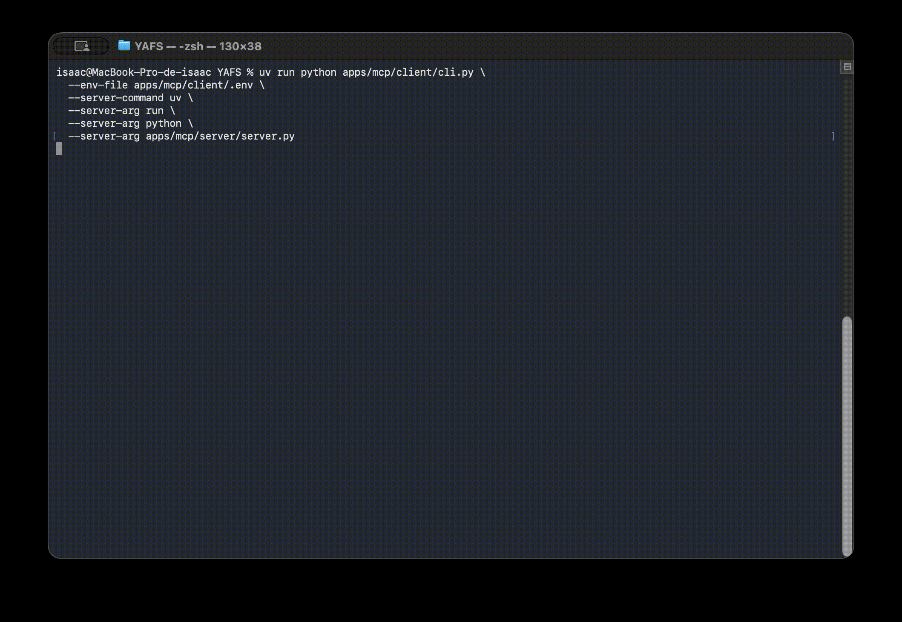

```text
██╗   ██╗ █████╗ ██╗███████╗███████╗
╚██╗ ██╔╝██╔══██╗██║██╔════╝██╔════╝
 ╚████╔╝ ███████║██║█████╗  ███████╗
  ╚██╔╝  ██╔══██║██║██╔══╝  ╚════██║
   ██║   ██║  ██║██║██║     ███████║
   ╚═╝   ╚═╝  ╚═╝╚═╝╚═╝     ╚══════╝
```
⚡ YAIFS - Yet (not) Another Intelligent Fog Simulator: A Framework for Agent-Driven Computing Continuum Modeling & Simulation ⚡

YAIFS is the current project branding and evolution of the original YAFS
simulator. For compatibility, the Python package name and import path remain
`yafs`, so existing code and tutorials can continue to use
`from yafs ... import ...` while the user-facing project name is `YAIFS`.





YAIFS is released under the MIT License. However, we would like to know in which projects or publications you have used or mentioned YAIFS.

**Please consider using the following citation when you use YAIFS or the `yafs` package**:

```bash
    Pending

```

Bibtex:
```
    Pending
  
```

Architecture
------------

```text
           AI Agent
             │
+---------------+
|  MCP      ◀┘  | ◀── User
+---------------+
|  SERVICE  ◀┘  | ◀── User
+---------------+
|  API          | ◀── User
+---------------+
+---------------+
|  CORE         | ◀── User
+---------------+
```


Installation
------------

YAIFS supports Python 3.12 (last compatibility check on Python 3.12).  YAIFS uses [uv](https://docs.astral.sh/uv/) as python project manager.

1. Clone the project in your local folder:

```bash
git clone https://github.com/acsicuib/YAIFS.git
```

2. Install dependencies:

```bash
cd YAIFS/
uv sync
uv pip install -e .
```

Compatibility note:

- the project and documentation use the `YAIFS` name
- the installed Python package is still `yafs`
- imports therefore remain `import yafs` and `from yafs...`

Getting started
---------------

The `tutorial_scenarios/` directory holds runnable examples. They range from small
core-layer demos to larger API- and service-layer workflows.

**Legacy numbered tutorials** (original YAFS-style, minimal layout):

- `01_basicExample` — smallest end-to-end run: topology, applications, placement,
  routing, and CSV traces.
- `02_serviceMovement` — relocates running service instances over time using a DES
  monitor.
- `03_topologyChanges` — mutates the topology while the simulation is active.
- `04_userMovement` — user lifecycle and mobility on the evolving graph.

**Consolidated and higher-level examples** (preferred if you are new to the
codebase):

- `using_core_layer` — one script that combines the behaviors of `01`–`04` in a
  single experiment on the core layer.
- `using_API_layer` — same service-movement idea as `02`, implemented with
  `yafs.api` (`Infrastructure`, `Simulation`, and processes).
- `using_service_layer_01` — `SimulationService` with simulation forks to compare
  a baseline branch against branches with cumulative node failures.
- `using_service_layer_02` — `SimulationService` with forks plus dynamic topology
  operations (for example creating clusters and nodes, and updating or removing
  nodes) driven from JSON action definitions.
- `multi_agent_scenario` — large hierarchical CDC/EDC/MEC topology with
  multi-agent placement logic, optional MCP interaction logs, and helper scripts
  for plots and reports.

Several folders include a `README.md` with the exact layout, how to run the
script, and expected outputs; start there when exploring a scenario.

MCP Client example APP 
----------------------
MCP client enables you to chat with the simulator using a LLM. You need fill the values of the file to `apps/mcp/client/.env` and fill in your values.

```bash
# Required
OPENAI_API_KEY=your_openai_api_key_here
OPENAI_MODEL=gpt-5
OPENAI_BASE_URL=https://api.openai.com/v1
```


To run a simple  configuration of MCP:

```bash
uv run python apps/mcp/client/cli.py \
  --env-file apps/mcp/client/.env \
  --server-command uv \
  --server-arg run \
  --server-arg python \
  --server-arg apps/mcp/server/server.py \
  --server-arg --scenario-path \
  --server-arg lab_scenarios/case_three_cluster/three-cluster
```

You can find more information in `apps/mcp/client` and `apps/mcp/server` README files.


Simulation Service API
----------------------

YAIFS includes a high-level `SimulationService` for long-lived simulations. In
this API, a simulation is conceptually open-ended and only becomes terminal when
`service.stop(...)` is invoked.

Key ideas:

* `service.schedule_for(simulation_id, duration=..., step=...)` schedules an incremental execution window. `duration` is relative to the current simulated time, not an absolute final time.
* `service.wait_until_ready(simulation_id)` waits until the simulation is ready for the next command. This usually means the scheduled window has finished and the status is `idle`.
* `service.pause(simulation_id)` pauses execution after the current internal `step` finishes.
* `service.fork(simulation_id)` waits until the parent simulation is paused or no longer running before cloning it.
* `service.stop(simulation_id)` is the terminal command. After `stop`, the simulation cannot be resumed or scheduled again.

Status semantics:

* `created`: the simulation exists but has not been initialized yet.
* `initialized`: the simulation has been initialized and is ready to run.
* `running`: the simulation is actively executing a scheduled window.
* `paused`: the simulation is paused and can be resumed or scheduled again.
* `idle`: the last scheduled window has finished and the simulation is ready for the next command.
* `stopped`: terminal state reached through `service.stop(...)`.
* `failed`: terminal state caused by an error.

Typical flow:

```python
from pathlib import Path

from yafs.services.simulation_service import SimulationService

service = SimulationService()
created = service.create_simulation(
    scenario_path=Path("lab_scenarios/case_three_cluster/three-cluster"),
    seed=2026,
    name="case-three-cluster",
)

service.schedule_for(created.summary.id, duration=20000, step=2000.0)
state = service.wait_until_ready(created.summary.id)

forked = service.fork(created.summary.id)
service.schedule_for(forked.summary.id, duration=20000, step=2000.0)
fork_state = service.wait_until_ready(forked.summary.id)

service.stop(created.summary.id)
service.stop(forked.summary.id)
```

Compatibility note:

* `service.run_for(...)` remains available as an alias of `service.schedule_for(...)`.
* `service.wait_until_idle(...)` remains available as an alias of `service.wait_until_ready(...)`.


Metrics
-------

YAIFS includes an expanded metrics layer with two complementary views:

* Offline analysis through `yafs.metrics.MetricsAnalyzer` over `*.csv` and `*_link.csv`
* Live deployment and infrastructure metrics through `Simulation` and `SimulationService`

The current catalog includes:

* node utilization
* CPU available and total per node
* RAM available and total per node
* cluster utilization
* users assigned per node
* link utilization
* total hops per request
* mean response latency per application
* traversed distance in kilometres per request and per application
* mean topology congestion
* total used bandwidth
* total available bandwidth
* total number of links
* execution cost and placement cost as separate concepts

Reference documents:

* [metrics.md](metrics.md)
* [Metrics Overview](docs/introduction/metrics.rst)


Documentation and Help
----------------------
Currently we are working in this

Changelog
-----------
- 21/04/2026 YAIFS becomes the public project branding while the Python package remains `yafs` for compatibility.

Acknowledgment
--------------

- This work was supported by Grant PID2024-158637OB-I00, funded by MICIU/AEI/\-10.13039/\-501100011033 and by ``ERDF A way of making Europe'' (ERDF/EU).
- Thanks to the small community of YAFS contributors who have been improving the code and providing new suggestions over the years.


Please [send us your reference so we can publish it](mailto:isaac.lera@uib.es)! And of course, feel free to add your references or works using YAIFS! 
