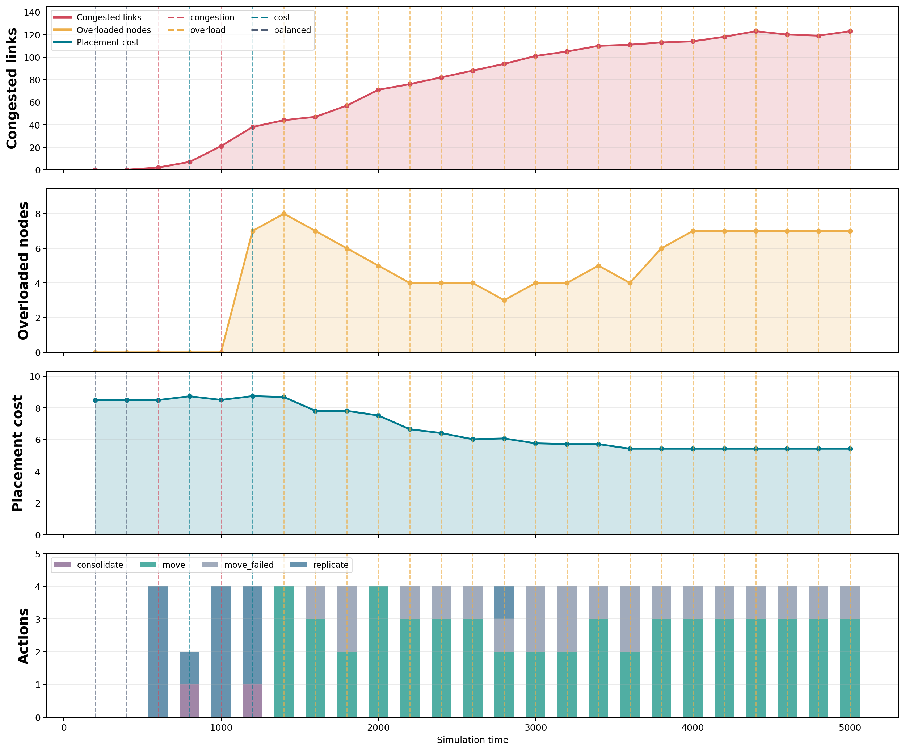

# Multi-Agent Scenario: Descripcion y Resultados

Este documento resume el escenario `multi_agent_scenario`, los agentes que intervienen en la simulacion y los resultados esperados del experimento multiagente actual.

## Overview Del Escenario

El escenario modela una infraestructura jerarquica de computacion distribuida para aplicaciones con restricciones de latencia. La topologia se define en [topology.json](topology.json) y representa una red con tres niveles:

| Nivel | Cantidad | Funcion |
| --- | ---: | --- |
| `CDC` | 3 clusters | Nodos centrales, mas alejados de los usuarios pero con coste/escala de nube. |
| `EDC` | 10 clusters | Nodos regionales/intermedios. |
| `MEC` | 27 clusters | Nodos cercanos a usuarios, usados como puntos de acceso y edge. |

En total hay `40` clusters, `214` nodos y `174` workers. Los usuarios se generan sobre workers MEC, mientras que los servicios pueden desplegarse en workers CDC, EDC o MEC segun la politica de placement.

Las aplicaciones estan descritas en [services.json](services.json). El campo `latency_requirement` se interpreta como SLO p95 en unidades temporales de simulacion, no como milisegundos fisicos calibrados:

| Aplicacion | VNFs | Mensajes | SLO p95 |
| --- | ---: | ---: | ---: |
| `Perception Pipeline` | 3 | 4 | 120 |
| `Coordination Pipeline` | 2 | 3 | 75 |
| `Telemetry Monitoring` | 1 | 2 | 50 |

El escenario tiene tres scripts principales:

| Script | Proposito |
| --- | --- |
| [main_random.py](main_random.py) | Despliega 20 replicas iniciales con placement aleatorio y asigna usuarios a replicas compartidas. |
| [main_greedy.py](main_greedy.py) | Crea una instancia de aplicacion por usuario y coloca sus VNFs en el worker mas cercano. |
| [main_multi_agent.py](main_multi_agent.py) | Ejecuta una simulacion por ventanas con agentes de monitorizacion y placement dinamico. |

El flujo multiagente parte de una situacion inicial parecida al caso random: se despliegan `20` replicas aleatorias y despues se generan usuarios periodicamente. La diferencia es que la simulacion se avanza en ventanas accionables; al final de cada ventana los agentes observan metricas y pueden modificar el placement antes de continuar.

La configuracion actual del multiagente esta orientada a provocar sobrecarga controlada y observar decisiones de `move`. Para ello combina umbrales de overload sensibles con un evento `HotspotUsers` que concentra demanda de `Perception Pipeline`.

Ejemplo de ejecucion:

```bash
uv run tutorial_scenarios/multi_agent_scenario/main_multi_agent.py
```

Los resultados se escriben por defecto en [results_multi_agent](results_multi_agent). Si se quiere usar otra ruta, se puede pasar `--results-dir`.

## Parametrizacion

Los parametros mas relevantes de [main_multi_agent.py](main_multi_agent.py) son:

| Parametro | Valor | Interpretacion |
| --- | ---: | --- |
| `replica_count` | 20 | Replicas iniciales desplegadas aleatoriamente. |
| `activation_interval` | 200.0 | Separacion entre activaciones periodicas de usuarios. |
| `activation_count` | 20 | Numero de activaciones periodicas. |
| `post_activation_tail` | 1000.0 | Tiempo adicional tras la ultima activacion. |
| `users_per_activation` | 10 | Usuarios creados por activacion nominal. |
| `user_lambda` | 100.0 | Tasa nominal de generacion de mensajes por usuario. |
| `window_duration` | 200.0 | Duracion de cada ventana accionable. |
| `mec_worker_ipt` | 10.0 | Capacidad configurada para workers MEC. |
| `link_utilization_threshold` | 0.5 | Umbral para marcar enlaces congestionados. |
| `node_utilization_threshold` | 0.08 | Umbral para marcar nodos sobrecargados. |
| `overload_streak_windows` | 1 | Ventanas necesarias para confirmar overload. |
| `placement_cost_budget` | 8.70 | Presupuesto a partir del cual se activa la estrategia de coste. |
| `action_budget_per_window` | 4 | Acciones maximas del agente por ventana. |

Esta parametrizacion busca que el agente no quede dominado solo por congestion de enlaces. La sobrecarga de nodos se detecta antes, y cuando aparece se priorizan acciones `move`. Ademas, el presupuesto de coste se ha situado dentro del rango observado del experimento para que tambien aparezcan decisiones `cost` y acciones `consolidate`. La degradacion por latencia ya no usa un umbral global: se compara `response_p95` contra el SLO p95 propio de cada aplicacion.

## Modelo De Coste

El escenario usa el campo `COST` de cada nodo de [topology.json](topology.json) como precio unitario de mantener una VNF desplegada en ese nodo. En las metricas finales, el coste principal reportado es `placement_cost`.

Formalmente, para una aplicacion `a`:

```text
placement_cost(a) =
  sum(COST(node(d)) : d es un despliegue VNF activo de a)
```

Donde `d` es una instancia desplegada de una VNF y `node(d)` es el nodo donde esta instancia esta alojada. Por tanto, el coste no depende directamente del trafico procesado, sino del numero de replicas/VNFs activas y del precio de los nodos donde residen.

El calculo se realiza en la capa API, en [../../src/yafs/api.py](../../src/yafs/api.py), dentro de `Simulation.get_application_metrics_summary`: la funcion recorre `alloc_module`, localiza el nodo de cada despliegue en `alloc_DES` y suma `node_attrs["COST"]` para cada VNF desplegada. Despues anade:

```text
total_cost(a) = placement_cost(a) + egress_cost(a)
```

En este escenario, `egress_cost_per_gb=0.02`, pero el trafico es pequeno y el coste de egress final es practicamente nulo. Por eso `total_cost` suele coincidir con `placement_cost`.

Hay que distinguir este coste del coste de ejecucion que existe en [../../src/yafs/metrics.py](../../src/yafs/metrics.py), `MetricsAnalyzer.application_execution_cost_breakdown`, donde se calcula:

```text
execution_cost(a) =
  sum(service_time(a, node) * COST(node))
```

Ese coste de ejecucion es una metrica basada en tiempo de servicio, pero no es la que usa el `PlacementAgent` para activar la estrategia `cost`. El agente usa `placement_cost` desde `app_metrics`.

Los precios configurados para los nodos se han unificado por nivel: `CDC=0.01`, `EDC=0.06` y `MEC=0.30`, independientemente de si el nodo es `worker` o `control-plane`.

| Nivel | Rol de nodo | COST | Nodos | WATT | Capacidad |
| --- | --- | ---: | ---: | ---: | --- |
| `CDC` | `control-plane` | 0.01 | 3 | 3.0 | 2.0 CPU, 4096m |
| `CDC` | `worker` | 0.01 | 47 | 2.2 | 2.0 CPU, 4096m |
| `EDC` | `control-plane` | 0.06 | 10 | 1.2 | 1.5 CPU, 2048m |
| `EDC` | `worker` | 0.06 | 27 | 1.0 | 1.0 CPU, 1536m |
| `MEC` | `control-plane` | 0.30 | 27 | 1.8 | 2.0 CPU, 3072m |
| `MEC` | `worker` | 0.30 | 100 | 1.4 | 1.5 CPU, 2560m |

La jerarquia de precios hace que los nodos `MEC` sean los mas caros, los `EDC` intermedios y los `CDC` los mas baratos. Esto fuerza un compromiso: desplegar en MEC acerca los servicios a los usuarios, pero aumenta `placement_cost`; desplegar en CDC reduce coste, pero puede empeorar latencia y distancia de red.

En la ultima ejecucion, el coste final por aplicacion se descompone asi:

| Aplicacion | Despliegues | CDC | EDC | MEC | Placement cost |
| --- | ---: | ---: | ---: | ---: | ---: |
| `Coordination Pipeline` | 14 | 5 | 3 | 6 | 2.03 |
| `Perception Pipeline` | 33 | 17 | 8 | 8 | 3.05 |
| `Telemetry Monitoring` | 9 | 4 | 5 | 0 | 0.34 |

El coste total observado en la ventana se calcula como:

```text
placement_cost_total(W_k) =
  sum(placement_cost(a, W_k) : a en aplicaciones)
```

El `PlacementAgent` compara este valor con `placement_cost_budget=8.70`. Si lo supera, selecciona la estrategia `cost`, que prioriza consolidar despliegues hacia nodos menos costosos. En los resultados actuales el coste total maximo es aproximadamente `8.74`, por lo que la estrategia `cost` se activa en las ventanas en las que el coste supera el presupuesto.

## Agentes

### MonitoringAgent

`MonitoringAgent` observa el estado de la simulacion al final de cada ventana. No modifica el sistema: solo produce un snapshot que luego consume el agente de placement.

Sus entradas principales son:

| Metrica | Origen | Uso |
| --- | --- | --- |
| `response_p95` | Metricas de aplicacion | Detectar degradacion de aplicaciones. |
| `requests_unsuccessful` | Metricas de aplicacion | Detectar incidentes de entrega o respuesta. |
| Utilizacion de enlaces | `sim_trace*_link.csv` | Detectar congestion de red. |
| Utilizacion de nodos | `sim_trace*.csv` | Detectar sobrecarga de computo. |
| Coste de placement | Metricas agregadas de aplicacion | Alimentar decisiones de consolidacion. |

Formalmente, el agente de monitorizacion observa metricas del sistema como latencia de respuesta, peticiones no exitosas, utilizacion de nodos y congestion de enlaces. Al final de cada ventana temporal produce un snapshot del estado del sistema:

```text
S_k = {
  app_metrics_k,
  network_summary_k,
  node_utilization_k,
  placement_cost_k,
  overloaded_nodes_k,
  congested_links_k
}
```

En notacion compacta:

```text
S_k = (A_k, N_k, U_node_k, P_k, O_k, C_k)
```

Donde `A_k` contiene las metricas por aplicacion, incluyendo latencia p95, peticiones no exitosas y coste de placement por aplicacion; `N_k` resume el estado de red; `U_node_k` contiene la utilizacion computacional por nodo; `P_k` es el coste agregado de placement en la ventana; `O_k` es el conjunto de nodos sobrecargados; y `C_k` es el conjunto de enlaces congestionados. La utilizacion de enlace se calcula para construir `C_k`, pero no se usa directamente como entrada de la regla de seleccion del `PlacementAgent`.

Para una ventana `W_k = [t_k, t_{k+1})`, las metricas usadas por el agente son:

| Metrica | Formulacion | Condicion de incidente |
| --- | --- | --- |
| Latencia p95 por aplicacion | `response_p95(a, W_k) = Q_0.95({service_response(r) : r pertenece a a y termina en W_k})` | `response_p95(a, W_k) > latency_requirement(a)` genera `degradation`. |
| Peticiones no exitosas | `requests_unsuccessful(a, W_k) = max(requests_total(a, W_k) - requests_successful(a, W_k), 0)` | `requests_unsuccessful > 0` genera `incident`. |
| Utilizacion de nodo | `node_utilization(n, W_k) = sum(service_time(m) : m ejecuta en n y time_out(m) pertenece a W_k) / |W_k|` | `node_utilization > node_utilization_threshold` durante `overload_streak_windows` genera `overload`. |
| Utilizacion de enlace | `link_utilization(e, W_k) = bandwidth_used(e, W_k) / bandwidth_available(e)` con `bandwidth_used = sum(size(m) : m atraviesa e en W_k) / |W_k|` | `link_utilization > link_utilization_threshold` genera `congestion`. |

Donde:

- `service_response` es el tiempo extremo a extremo reconstruido para una peticion completada, incluyendo mensajes de retorno cuando `include_return_messages=True`.
- `latency_requirement(a)` es el SLO p95 definido para cada aplicacion en [services.json](services.json), expresado en unidades temporales de simulacion.
- `requests_total` cuenta peticiones emitidas por usuarios (`SRC_M`) en la ventana.
- `requests_successful` cuenta peticiones con al menos una ruta de servicio completada en la ventana.
- `service_time = time_out - time_in` se toma de los eventos de computo `COMP_M`.
- `|W_k|` es la duracion de la ventana.

En la capa API, el calculo se reparte asi:

| Elemento | Definicion en codigo | Comentario |
| --- | --- | --- |
| Metricas de aplicacion | [../../src/yafs/services/simulation_service.py](../../src/yafs/services/simulation_service.py), `SimulationService.get_application_metrics` | Expone la llamada API y aplica `from_time`, `to_time`, `reference_time` y `time_column`. |
| Agregado por aplicacion | [../../src/yafs/api.py](../../src/yafs/api.py), `Simulation.get_application_metrics_summary` | Construye el resumen por aplicacion y anade coste de placement/egress. |
| `response_p95`, `requests_total`, `requests_successful`, `requests_unsuccessful` | [../../src/yafs/metrics.py](../../src/yafs/metrics.py), `MetricsAnalyzer.summarize_service_response` | Calcula cuantiles de `service_response` y los contadores de requests. |
| Requests emitidas | [../../src/yafs/metrics.py](../../src/yafs/metrics.py), `MetricsAnalyzer.emitted_request_breakdown` | Cuenta requests por aplicacion a partir de eventos `SRC_M`. |
| Metricas de red expuestas por API | [../../src/yafs/api.py](../../src/yafs/api.py), `Simulation.get_network_metrics_summary` | Devuelve utilizacion de nodos, clusters, enlaces, hops y distancias. |
| Utilizacion de recursos de nodo en API | [../../src/yafs/api.py](../../src/yafs/api.py), `Simulation.get_node_resource_summary` | Calcula `(cpu_utilization + ram_utilization) / 2` a partir de VNFs desplegadas y capacidades del nodo. |
| Utilizacion de enlaces en API | [../../src/yafs/metrics.py](../../src/yafs/metrics.py), `MetricsAnalyzer.link_utilization` | Calcula `bandwidth_used / bandwidth_available` sobre la ventana observada por las trazas. |
| Utilizacion de nodo usada para overload en este escenario | [main_multi_agent.py](main_multi_agent.py), `load_window_node_utilization` | Usa trazas `COMP_M` de la ventana para medir carga efectiva de computo, no solo recursos reservados. |
| Utilizacion de enlace usada para congestion en este escenario | [main_multi_agent.py](main_multi_agent.py), `load_window_link_utilization` | Recalcula la utilizacion por enlace en la ventana accionable antes de aplicar el umbral. |

Esta separacion es importante: la API proporciona las metricas agregadas y los analizadores sobre trazas; el `MonitoringAgent` decide como convertir esas metricas en incidentes de ventana. En particular, para detectar overload se usa la carga efectiva de computo de `COMP_M` en la ventana, mientras que la API tambien expone una utilizacion de recursos basada en CPU/RAM reservada por las VNFs desplegadas.

### PlacementAgent

`PlacementAgent` toma el snapshot del monitor y selecciona una estrategia. Su presupuesto por ventana es `action_budget_per_window=4`, por lo que como maximo aplica cuatro acciones en cada ventana.

Las estrategias se seleccionan en este orden:

| Estrategia | Condicion | Efecto esperado |
| --- | --- | --- |
| `cost` | El coste de placement supera `placement_cost_budget`. | Prioriza consolidacion hacia nodos menos costosos. |
| `overload` | Hay nodos sobrecargados. | Prioriza `move`, moviendo VNFs fuera de nodos cargados. |
| `congestion` | Hay enlaces congestionados o aplicaciones degradadas. | Prioriza replicas cercanas a usuarios/regiones. |
| `balanced` | No hay condicion dominante. | No actua salvo que aparezca otra condicion. |

Las acciones que puede ejecutar son:

| Accion | Funcion |
| --- | --- |
| `replicate` | Crea una replica adicional de una VNF en un nodo destino. Para apps degradadas puede replicar la cadena completa. |
| `move` | Elimina una VNF de un nodo origen sobrecargado y la vuelve a desplegar en un nodo destino. |
| `consolidate` | Mueve una VNF desde un nodo `MEC` caro hacia un worker `EDC` o `CDC` mas barato si el coste excede el presupuesto. |
| `*_failed` | Registra intentos fallidos de accion, por ejemplo si el destino ya tiene esa VNF o si el estado cambio entre observacion y accion. |

## Evento HotspotUsers

El escenario incorpora un evento programado para concentrar demanda. El mismo patron temporal se registra en `main_random.py`, `main_greedy.py` y `main_multi_agent.py` para que los tres experimentos reciban una carga de estres comparable:

| Tiempo | Accion |
| ---: | --- |
| `1000` | Crea 60 usuarios adicionales de `Perception Pipeline` en `mec-i-1-worker-3`. |
| `1800` | Mueve esos usuarios a `mec-i-1-worker-4`. |
| `2600` | Elimina el 40% de esos usuarios. |

Este evento no es un agente de placement: modifica la carga de usuarios. En `main_random.py`, los usuarios hotspot consumen las replicas aleatorias ya desplegadas. En `main_greedy.py`, cada usuario hotspot crea su propia instancia dedicada de `Perception Pipeline`, manteniendo la semantica greedy de una aplicacion por usuario. En `main_multi_agent.py`, el evento permite provocar condiciones de sobrecarga que el `PlacementAgent` puede intentar corregir con acciones `move`, `replicate` o `consolidate`.

## Resultados Del Escenario Multiagente

La timeline principal esta en:



Resumen de estrategias:

| Estrategia | Ventanas |
| --- | ---: |
| `balanced` | 2 |
| `congestion` | 2 |
| `cost` | 2 |
| `overload` | 19 |

Resumen de acciones:

| Accion | Total |
| --- | ---: |
| `consolidate` | 2 |
| `move` | 54 |
| `move_failed` | 21 |
| `replicate` | 13 |

Este resultado confirma que la combinacion de umbrales, hotspot y presupuesto de coste cambia el regimen del agente. En la figura [results_multi_agent/multi_agent_strategy_timeline.png](results_multi_agent/multi_agent_strategy_timeline.png), la cuarta banda muestra acciones `move` de forma sostenida a partir de la aparicion de sobrecarga y dos acciones `consolidate` cuando el coste supera el presupuesto. La congestion sigue existiendo, pero las estrategias dominantes pasan a ser `overload` y, puntualmente, `cost`.

Metricas finales:

| Aplicacion | Requests | Exitosas | Fallidas | p95 respuesta | SLO p95 | Coste placement |
| --- | ---: | ---: | ---: | ---: | ---: | ---: |
| `Coordination Pipeline` | 1796 | 1779 | 17 | 130.55 | 75 | 2.03 |
| `Perception Pipeline` | 14108 | 2096 | 12012 | 1380.87 | 120 | 3.05 |
| `Telemetry Monitoring` | 1816 | 1784 | 32 | 74.20 | 50 | 0.34 |

El escenario sigue siendo un experimento de estres. El hotspot multiplica las peticiones de `Perception Pipeline` y produce muchas fallidas, aunque la parametrizacion actual evita que el sistema quede dominado exclusivamente por replicas. Su utilidad principal es demostrar que el agente puede abandonar la politica de solo replicacion, ejecutar evacuaciones `move` bajo sobrecarga y aplicar consolidaciones `cost` cuando el placement supera el presupuesto. Las tres aplicaciones superan su SLO p95 final, lo que confirma que la configuracion no representa un estado nominal, sino una situacion degradada controlada.

La lectura de la timeline es clave:

- La primera fase contiene ventanas `balanced`, `congestion` y `cost`, antes de que el hotspot domine el estado.
- La estrategia `cost` aparece en 2 ventanas y produce 2 consolidaciones exitosas de `Telemetry Monitoring`, cada una con ahorro estimado de `0.24`.
- Tras la concentracion de demanda, se detectan nodos sobrecargados y la estrategia pasa a `overload`.
- La cuarta banda permite distinguir las acciones reales: `consolidate`, `move`, `move_failed` y `replicate`.
- El coste maximo baja de `9.03` a `8.74` respecto a la ejecucion previa sin estrategia de coste activa, aunque el coste final no necesariamente baja porque las acciones posteriores de `overload` pueden volver a desplazar VNFs hacia nodos `MEC`.

## Anexo: Acciones Del PlacementAgent

El `PlacementAgent` actua al final de cada ventana, despues de que `MonitoringAgent` haya producido el snapshot `S_k`. El agente no vuelve a calcular las metricas base; consume la informacion ya observada y la transforma en una estrategia y en una lista acotada de acciones de placement.

El flujo por ventana es:

```text
1. MonitoringAgent observa la ventana W_k.
2. MonitoringAgent genera S_k con metricas, incidentes, nodos sobrecargados y enlaces congestionados.
3. PlacementAgent selecciona una estrategia a partir de S_k.
4. PlacementAgent propone acciones hasta action_budget_per_window.
5. Las acciones se ejecutan mediante la capa API/MCP.
6. La simulacion avanza a la siguiente ventana.
```

El snapshot usado por `PlacementAgent` contiene, entre otros, estos campos:

| Campo del snapshot | Uso por `PlacementAgent` |
| --- | --- |
| `app_metrics` | Calcula el coste total de placement y consulta latencias por aplicacion. |
| `apps_by_name` | Accede rapidamente a metricas de una aplicacion concreta. |
| `overloaded_nodes` | Selecciona nodos origen para acciones `move`. |
| `congested_links` | Influye en la seleccion de estrategia `congestion`. |
| `node_utilization` | Penaliza nodos cargados al elegir destinos. |
| `window_index` | Etiqueta acciones y evita repetir ciertas acciones en la misma ventana. |

### Seleccion De Estrategia

La estrategia se decide en `PlacementAgent._select_strategy` de [main_multi_agent.py](main_multi_agent.py). La regla es jerarquica:

```text
sigma_k =
  cost       si P_k > theta_cost
  overload   si O_k != empty
  congestion si C_k != empty
                or exists a in A_k such that response_p95(a, W_k) > latency_requirement(a)
                or exists a in A_k such that requests_unsuccessful(a, W_k) > 0
  balanced   otherwise
```

En notacion formal:

\[
\sigma_k =
\begin{cases}
\texttt{cost}, & \text{if } P_k > \theta_{\text{cost}}, \\
\texttt{overload}, & \text{if } \mathcal{O}_k \neq \emptyset, \\
\texttt{congestion}, & \text{if } \mathcal{C}_k \neq \emptyset
\lor \exists a \in \mathcal{A}_k :
\big(
\mathrm{response\_p95}(a,W_k) > \mathrm{latency\_requirement}(a)
\lor \mathrm{requests\_unsuccessful}(a,W_k) > 0
\big), \\
\texttt{balanced}, & \text{otherwise}.
\end{cases}
\]

Donde:

```text
P_k = sum(placement_cost(a, W_k) : a en A_k)
```

Asi, la politica no necesita introducir un conjunto adicional de incidentes: las degradaciones y fallos se derivan directamente de las metricas de aplicacion `A_k`. Tampoco usa la utilizacion de enlace como condicion directa; esa utilizacion solo interviene antes, en el `MonitoringAgent`, para construir el conjunto de enlaces congestionados `C_k`.

| Estrategia | Condicion | Parametrizacion que activa |
| --- | --- | --- |
| `cost` | `P_k > placement_cost_budget` | Prioriza consolidacion, prefiere `EDC/CDC/MEC` y aumenta el peso del coste. |
| `overload` | `O_k` no esta vacio y se prioriza overload cuando aparece. | Prioriza `move`, prefiere `MEC/EDC/CDC` y aumenta el peso de utilizacion. |
| `congestion` | `C_k` no esta vacio, o alguna aplicacion en `A_k` incumple su SLO p95, o tiene peticiones fallidas. | Prioriza replicas cerca de usuarios, sobre `MEC/EDC`. |
| `balanced` | No hay condicion dominante. | Mantiene una politica conservadora sin acciones salvo que aparezcan oportunidades posteriores. |

En el escenario actual, `prefer_overload_when_present=True`, por lo que la presencia de nodos sobrecargados desplaza a la estrategia `congestion` aunque sigan existiendo enlaces congestionados. Esta es la razon por la que, tras el hotspot, la timeline queda dominada por `overload`.

### Seleccion Del Nodo Destino

Tanto `replicate` como `move` usan una funcion comun de ranking para elegir destino. Para cada candidato se calcula una puntuacion:

```text
score(node) =
  mean_weighted_distance(users, node)
  + utilization_weight * node_utilization(node)
  + cost_weight * node_cost(node)
  + region_penalty(node)
```

El destino elegido es el nodo con menor `score`. Esto combina cuatro criterios:

| Criterio | Efecto |
| --- | --- |
| Distancia media a usuarios | Favorece nodos cercanos a la demanda actual de la aplicacion. |
| `node_utilization` | Evita mover o replicar VNFs hacia nodos ya cargados. |
| Coste del nodo | Penaliza destinos caros cuando la estrategia da peso al coste. |
| Region dominante | Favorece candidatos en la misma region que concentra usuarios. |

La region dominante se obtiene contando los usuarios actuales de la aplicacion por `cluster_region`. Para obtener usuarios y despliegues actuales, el agente consulta la API mediante `list_simulation_users`, `list_simulation_application_vnfs` y `list_simulation_node_placements`.

### Accion `replicate`

La accion `replicate` se usa principalmente cuando hay aplicaciones degradadas o con peticiones fallidas. El agente:

1. Extrae de `incidents` las aplicaciones con `type in {degradation, incident}`.
2. Obtiene los usuarios actuales de cada aplicacion.
3. Calcula la region dominante de esos usuarios.
4. Consulta las VNFs ya desplegadas para evitar replicar en un nodo que ya tiene esa VNF.
5. Selecciona un nodo destino con la funcion de ranking.
6. Replica la cadena de VNFs de la aplicacion en ese destino, modulo a modulo.

La llamada efectiva se realiza con `replicate_application_vnf`. En la API, [../../src/yafs/api.py](../../src/yafs/api.py) comprueba que la aplicacion, la VNF y el nodo destino existen, verifica que la VNF no este ya desplegada en el destino y ejecuta `deploy_module`. El resultado registrado incluye `type=replicate`, aplicacion, modulo, nodo destino y estado.

Si una replica falla, se registra `replicate_failed` con la razon. El presupuesto `action_budget_per_window` limita el numero de acciones devueltas por ventana, por lo que no todas las replicas propuestas tienen por que ejecutarse si ya se ha alcanzado el limite.

### Accion `move`

La accion `move` se usa para evacuar VNFs desde nodos sobrecargados. Cuando la estrategia prioriza movimientos, se ejecuta antes que la replicacion. El agente:

1. Recorre `snapshot["overloaded_nodes"]`.
2. Para cada nodo sobrecargado, consulta las VNFs desplegadas en ese nodo.
3. Ordena las VNFs candidatas priorizando aplicaciones con mayor `response_p95`.
4. Elige como origen el nodo sobrecargado y como modulo la primera VNF candidata.
5. Selecciona un nodo destino usando usuarios actuales, region del origen, utilizacion y coste.
6. Ejecuta `move_application_vnf`.

La llamada efectiva se realiza con `move_application_vnf`. En la API, [../../src/yafs/api.py](../../src/yafs/api.py) valida aplicacion, VNF, origen y destino; despues hace `undeploy_module` en el origen y `deploy_module` en el destino. Por eso el `move` actual es una reubicacion inmediata: elimina una instancia y crea otra nueva.

El resultado registrado incluye `type=move`, aplicacion, modulo, `from_node`, `to_node` y estado. Si la VNF ya existe en destino, si no existe en origen o si el estado cambio entre observacion y accion, se registra `move_failed`.

### Accion `consolidate`

La accion `consolidate` se usa cuando domina la estrategia `cost`. En ese caso, el agente intenta reducir coste moviendo una VNF alojada en un worker `MEC` hacia un worker mas barato `EDC` o `CDC`.

El procedimiento es:

1. Calcula `total_cost = sum(placement_cost)` desde `app_metrics`.
2. Si `total_cost <= placement_cost_budget`, no consolida.
3. Recorre las VNFs desplegadas de todas las aplicaciones y selecciona despliegues ubicados en nodos `MEC`.
4. Descarta destinos que ya tengan esa misma VNF para evitar duplicados.
5. Prioriza destinos `EDC` y despues `CDC`, siempre con coste inferior al origen.
6. Dentro de esos candidatos, prefiere la misma region, menor `node_utilization`, menor coste y nombre.
7. Ordena las candidatas intentando afectar primero a aplicaciones con menor `response_p95` y mayor ahorro estimado.
8. Ejecuta `move_application_vnf` y registra `consolidate` o `consolidation_failed`.

En los resultados actuales aparecen 2 acciones `consolidate`, ambas sobre la VNF `0_MON` de `Telemetry Monitoring`, movidas de `MEC` a `EDC` con un ahorro estimado de `0.24` por accion. Aunque la logica ya no esta limitada a esa aplicacion, el ranking la elige porque es la opcion menos disruptiva entre las candidatas disponibles en esas ventanas.

### Orden De Ejecucion Y Presupuesto

El metodo `PlacementAgent.act` aplica las acciones en este orden:

| Fase | Condicion | Acciones |
| --- | --- | --- |
| 1 | Estrategia con `prioritize_moves=True` | Ejecuta `move` sobre nodos sobrecargados. |
| 2 | Estrategia con `prioritize_consolidation=True` | Intenta `consolidate`. |
| 3 | Aplicaciones degradadas o con fallos | Intenta `replicate` de cadenas de VNFs. |
| 4 | Si los movimientos no eran prioritarios | Puede ejecutar `move` despues de replicar. |
| 5 | Si la consolidacion no era prioritaria | Puede intentar `consolidate` al final. |

Todas las acciones se cortan por `action_budget_per_window=4`. Ademas, `last_app_action_window` evita repetir una accion de replicacion sobre la misma aplicacion dentro de la misma ventana.

Finalmente, el agente registra su decision en `mcp_interactions.jsonl` y `mcp_interactions.md` con la estrategia seleccionada, el numero de incidentes y las acciones aplicadas. Estos registros son los que luego usa [plot_multi_agent_timeline.py](plot_multi_agent_timeline.py) para visualizar la banda de estrategias y la banda de tipos de accion.

## Anexo: Peticiones Fallidas En Perception Pipeline

El numero elevado de peticiones fallidas de `Perception Pipeline` es consecuencia directa del objetivo experimental: concentrar demanda sobre una aplicacion concreta y forzar acciones `move` bajo sobrecarga. No debe interpretarse como el comportamiento nominal de una configuracion estable, sino como el efecto de un caso de estres disenado para observar evacuaciones de VNFs.

La primera razon es el evento `HotspotUsers`. A partir de `t=1000`, el escenario crea `60` usuarios adicionales de `Perception Pipeline` en `mec-i-1-worker-3`, con `user_lambda=15.0`. Esta tasa genera peticiones con mucha mas frecuencia que la carga nominal. Por eso `Perception Pipeline` alcanza `14108` requests, frente a `1796` de `Coordination Pipeline` y `1816` de `Telemetry Monitoring`. La aplicacion no solo falla mas: tambien emite muchas mas peticiones que el resto.

La segunda razon es que `Perception Pipeline` tiene una cadena de servicio mas larga. Segun [services.json](services.json), la aplicacion tiene `3` VNFs y `4` mensajes. Una peticion solo cuenta como exitosa si completa toda la cadena y el retorno al usuario. Por tanto, cualquier problema en un salto intermedio, en una VNF movida o en el camino de vuelta puede convertir la peticion en fallida. `Telemetry Monitoring`, por ejemplo, tiene una unica VNF y menos puntos de fallo.

La tercera razon es la interaccion entre el hotspot y las acciones `move`. El agente entra mayoritariamente en estrategia `overload` y ejecuta movimientos de VNFs desde nodos sobrecargados. La timeline [results_multi_agent/multi_agent_strategy_timeline.png](results_multi_agent/multi_agent_strategy_timeline.png) muestra esta transicion: tras las primeras ventanas, la estrategia dominante pasa a `overload` y la cuarta banda acumula acciones `move` y `move_failed`.

El movimiento actual de una VNF es agresivo: retira la instancia del nodo origen y despliega otra en el nodo destino. Si existen mensajes en vuelo hacia la instancia antigua, esos mensajes pueden quedar sin destino. Durante la ejecucion aparecen avisos de rutas no alcanzables, especialmente para mensajes de `Perception Pipeline`, como `M.PP.0_1`, `M.PP.0_2` y `M.PP.0_3`. Esto encaja con la metrica final: muchas peticiones son emitidas, pero no consiguen completar la cadena completa.

El propio evento de hotspot tambien mueve y reduce usuarios: en `t=1800` desplaza los usuarios concentrados a `mec-i-1-worker-4`, y en `t=2600` elimina el `40%`. Estos cambios ayudan a provocar nuevas condiciones de sobrecarga, pero tambien pueden afectar a mensajes en vuelo que intentan retornar a usuarios reubicados o eliminados.

Por estas razones, el resultado de `Perception Pipeline` combina cuatro efectos:

| Factor | Efecto sobre las peticiones |
| --- | --- |
| Hotspot de usuarios | Aumenta mucho el numero total de requests. |
| `user_lambda=15.0` | Incrementa la frecuencia de generacion de trafico. |
| Cadena con 3 VNFs | Aumenta los puntos donde una request puede fallar. |
| Acciones `move` frecuentes | Pueden romper mensajes en vuelo hacia instancias antiguas o retornos de usuario. |

La p95 de respuesta de `1380.87` refuerza esta interpretacion: incluso las peticiones exitosas sufren colas, congestion y reconfiguracion del placement. En consecuencia, la tabla de resultados debe leerse como evidencia de un escenario de estres que fuerza al agente a moverse, no como una configuracion estable de produccion.

Para reducir las fallidas manteniendo acciones `move`, las mitigaciones mas directas serian bajar el hotspot a `30-40` usuarios, subir `user_lambda` a `25-30`, reducir `action_budget_per_window` de `4` a `2`, introducir cooldowns por aplicacion/modulo y sustituir el `move` inmediato por un movimiento con drenaje: replicar primero en destino, mantener temporalmente la instancia antigua y retirarla despues de una ventana de gracia.

## Artefactos Relevantes

| Artefacto | Descripcion |
| --- | --- |
| [results_multi_agent/window_metrics.json](results_multi_agent/window_metrics.json) | Resumen por ventana del escenario multiagente. |
| [results_multi_agent/mcp_interactions.md](results_multi_agent/mcp_interactions.md) | Log legible de interacciones MCP y decisiones del agente. |
| [results_multi_agent/multi_agent_mcp_report.md](results_multi_agent/multi_agent_mcp_report.md) | Reporte generado automaticamente. |
| [results_multi_agent/final_application_metrics.json](results_multi_agent/final_application_metrics.json) | Metricas finales por aplicacion. |
| [plot_multi_agent_timeline.py](plot_multi_agent_timeline.py) | Script para generar la timeline con congestion, overload, coste y acciones. |

## Anexo: Papel De MCP En La Interaccion Entre Agentes

En este escenario, MCP actua como una capa de herramientas comun entre los agentes y la simulacion. No representa una conversacion directa entre `MonitoringAgent` y `PlacementAgent`; mas bien proporciona una interfaz uniforme para observar, consultar y modificar el estado de la simulacion.

La relacion puede resumirse asi:

```text
SimulationService
      ^
InProcessMcpClient / MCP tool surface
      ^
MonitoringAgent y PlacementAgent
```

El script intenta construir un servidor `FastMCP` mediante `build_mcp_server`. Si el transporte MCP esta disponible, el escenario lo registra como `FastMCP server available`. Aun asi, la ejecucion local usa `InProcessMcpClient`, un adaptador en proceso que expone la misma superficie conceptual de herramientas sin necesidad de levantar un servidor externo.

El flujo por ventana es:

1. El sistema avanza la simulacion con llamadas tipo herramienta: `schedule_for` y `wait_until_ready`.
2. `MonitoringAgent` consulta metricas mediante `get_simulation_application_metrics` y `get_simulation_network_metrics`.
3. Con esas observaciones construye el snapshot `S_k`.
4. `PlacementAgent` recibe `S_k` directamente en el bucle Python y selecciona la estrategia de placement.
5. Si decide actuar, consulta informacion adicional con herramientas como `list_simulation_users`, `list_simulation_application_vnfs` y `list_simulation_node_placements`.
6. Las acciones se aplican mediante herramientas como `replicate_application_vnf` y `move_application_vnf`.

Por tanto, MCP cumple tres funciones principales:

| Funcion | Papel en el escenario |
| --- | --- |
| Interfaz comun | Los agentes no manipulan directamente estructuras internas de la simulacion; llaman a operaciones expuestas por `SimulationService`. |
| Desacoplamiento | La misma logica de agentes puede razonar en terminos de herramientas, independientemente de si la llamada es in-process o se expone mediante un transporte MCP real. |
| Trazabilidad | Cada llamada queda registrada con actor, ventana, herramienta invocada, estado de la simulacion, entrada resumida, salida resumida y estado `ok/error`. |

El intercambio entre monitor y placement no se realiza mediante mensajes MCP entre agentes. El monitor produce `S_k` y el placement lo consume como argumento de `PlacementAgent.act`. MCP interviene antes y despues de esa transferencia: antes, para obtener las metricas con las que se construye `S_k`; despues, para ejecutar las acciones de placement seleccionadas.

Los artefactos que reflejan esta interaccion son:

| Artefacto | Contenido |
| --- | --- |
| [results_multi_agent/mcp_interactions.jsonl](results_multi_agent/mcp_interactions.jsonl) | Registro estructurado de llamadas a herramientas y mensajes de decision. |
| [results_multi_agent/mcp_interactions.md](results_multi_agent/mcp_interactions.md) | Version legible del log de interacciones. |
| [results_multi_agent/window_metrics.json](results_multi_agent/window_metrics.json) | Resumen por ventana con estrategia, coste, congestion, overload y acciones. |

Esta separacion permite auditar que observo el `MonitoringAgent`, que estrategia eligio el `PlacementAgent` y que herramientas se usaron para materializar cada accion sobre la simulacion.